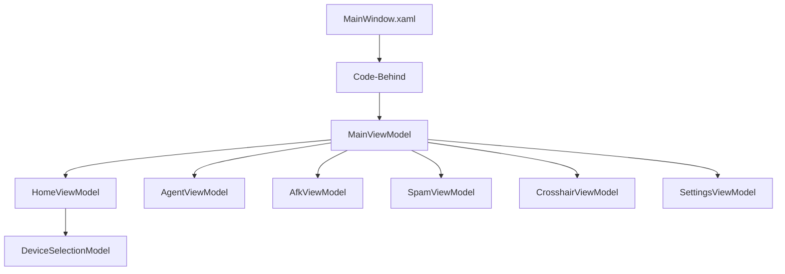
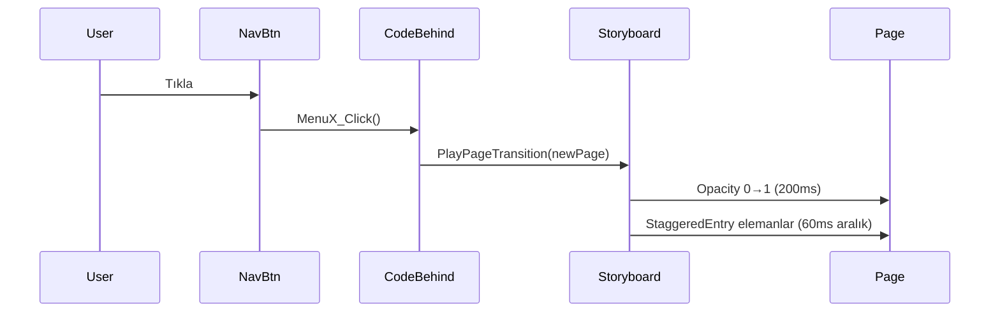

# Design Document — Klyze UI Overhaul

## Overview

Bu tasarım belgesi, Klyze.gg WPF/C# masaüstü uygulamasının kapsamlı görsel ve işlevsel güncellemesini tanımlar. Güncelleme beş ana alanı kapsar:

1. **Monokrom Renk Teması** — AccentRed (#FF4655) ve AccentGreen (#00D26A) kaldırılarak tüm UI siyah/gri/beyaz tonlarına geçirilir.
2. **Üst Bar Yeniden Tasarımı** — Ortada logo+isim, sağda pencere kontrolleri, GameSelector kaldırılır.
3. **Türkçe Karakter Düzeltmeleri** — Bozuk UTF-8 encoding (üç, seçimi, yazı, uyarı) düzeltilir.
4. **Ana Sayfa Cihaz Seçimi** — Klavye/Monitör/Fare kategorileri, glassmorphism kartlar, toggle seçim.
5. **Animasyonlar** — Staggered page entry, button press scale, card hover lift, page transition opacity.

Proje WPF (.NET 8, C#) üzerine kuruludur. Tüm UI tanımları `MainWindow.xaml` içinde, iş mantığı `MainWindow.xaml.cs` ve `ViewModels/MainViewModel.cs` içinde yer almaktadır. Üçüncü taraf UI kütüphanesi kullanılmamaktadır; animasyonlar WPF'in yerleşik `Storyboard`/`DoubleAnimation` mekanizmasıyla gerçekleştirilir.

---

## Architecture

### Mevcut Mimari

```
MainWindow.xaml          ← Tüm sayfaları içeren tek XAML dosyası (1065 satır)
MainWindow.xaml.cs       ← Code-behind: sayfa görünürlüğü, hotkey, tray, event yönlendirme
ViewModels/
  MainViewModel.cs       ← Ana ViewModel: navigasyon, tema, dil, config
  AgentViewModel.cs      ← Ajan kilitleme mantığı
  AfkViewModel.cs        ← AFK modu mantığı
  SpamViewModel.cs       ← Yazı spam mantığı
  CrosshairViewModel.cs  ← Crosshair profil yönetimi
  SettingsViewModel.cs   ← Ayarlar
  PlayerAnalysisViewModel.cs
Models/
  Enums.cs               ← PageType, Language, Theme enum'ları
Services/
  ConfigService.cs       ← JSON config okuma/yazma
  ClickingService.cs
  AfkService.cs
  SpamService.cs
  CrosshairService.cs
  LoggingService.cs
```

### Güncelleme Sonrası Mimari Değişiklikleri

Mevcut tek-dosya XAML mimarisi korunur; yeni bileşenler aynı dosyaya eklenir. Ek olarak:

- `Models/DeviceSelectionModel.cs` — Cihaz seçim durumunu tutan model sınıfı eklenir.
- `ViewModels/HomeViewModel.cs` — Ana sayfa cihaz seçim mantığı için ayrı ViewModel eklenir.
- `MainViewModel.cs` — `HomeVM` property'si eklenir.



### Animasyon Mimarisi

WPF `Storyboard` tabanlı animasyonlar iki yolla uygulanır:

1. **XAML Triggers** — Hover ve seçim animasyonları `ControlTemplate.Triggers` içinde tanımlanır.
2. **Code-Behind Storyboard** — Sayfa geçiş ve staggered entry animasyonları `MainWindow.xaml.cs` içinde programatik olarak oluşturulur.



---

## Components and Interfaces

### 1. ResourceDictionary — Monokrom Renk Paleti

`MainWindow.xaml` içindeki `Window.Resources` bölümü güncellenir:

| Kaynak Adı | Eski Değer | Yeni Değer | Açıklama |
|---|---|---|---|
| `AccentRed` | `#FF4655` | **Kaldırılır** | Tüm referanslar güncellenir |
| `AccentGreen` | `#00D26A` | **Kaldırılır** | Tüm referanslar güncellenir |
| `AccentWhite` | — | `#FFFFFF` | Yeni birincil vurgu |
| `AccentLightGray` | — | `#E0E0E0` | İkincil vurgu |
| `SidebarBg` | `#1A1A1A` | `#141414` | Korunur, hafif koyulaştırılır |
| `CardBg` | `#1E1E1E` | `#1E1E1E` | Korunur |
| `CardDark` | `#252525` | `#252525` | Korunur |
| `TextWhite` | `#FFFFFF` | `#FFFFFF` | Korunur |
| `TextGray` | `#888888` | `#888888` | Korunur |
| `BorderCol` | `#2A2A2A` | `#2A2A2A` | Korunur |

**Güncellenen Stiller:**

- `BigRedBtn` → `BigPrimaryBtn`: Arka plan `#2A2A2A`, metin `#FFFFFF`, hover `#3A3A3A`
- `RedBtn` → `PrimaryBtn`: Arka plan `#2A2A2A`, metin `#FFFFFF`
- `RedSlider` → `MonoSlider`: Track rengi `#FFFFFF` (aktif), `#3A3A3A` (pasif)
- `NavBtn` aktif durumu: Sol kenarlık `#FFFFFF 2px`, arka plan `#252525`

### 2. TopBar Bileşeni

```
┌─────────────────────────────────────────────────────────┐
│ ─────────────────────────────────────────────────────── │  ← 1px #2A2A2A çizgi
│                    [🔷] Klyze                           │  ← Ortalanmış logo+isim
│                                                  [−][×] │  ← Sağda kontroller
└─────────────────────────────────────────────────────────┘
```

**Yapısal Değişiklikler:**
- `GameSelector` ComboBox kaldırılır (veya Settings sayfasına taşınır)
- `Header_MouseLeftButtonDown` event handler korunur (DragMove)
- Yükseklik: 60px → 50px
- Logo: `Image` (32×32) + `TextBlock` "Klyze" (12px, normal weight) dikey stack

**XAML Yapısı:**
```xml
<Border Grid.Row="0" Background="#1A1A1A" Height="50">
    <!-- Üst ince çizgi -->
    <Border.BorderBrush>#2A2A2A</Border.BorderBrush>
    <Border.BorderThickness>0,1,0,0</Border.BorderThickness>
    <Grid>
        <!-- Orta: Logo + İsim -->
        <StackPanel HorizontalAlignment="Center" Orientation="Vertical">
            <Image Source="uygulama_logusu.png" Width="32" Height="32"/>
            <TextBlock Text="Klyze" FontSize="12" Foreground="White"/>
        </StackPanel>
        <!-- Sağ: Pencere Kontrolleri -->
        <StackPanel HorizontalAlignment="Right" Orientation="Horizontal">
            <Button Content="−" Width="40" Height="40" Click="MinimizeButton_Click"/>
            <Button Content="×" Width="40" Height="40" Click="CloseButton_Click"/>
        </StackPanel>
    </Grid>
</Border>
```

### 3. Sidebar Navigasyon Güncellemesi

**Aktif Durum Değişikliği** (`SetNavActive` metodu güncellenir):

```csharp
// Eski
btn.Background = active ? new SolidColorBrush(Color.FromRgb(0x2A, 0x15, 0x15)) : Transparent;
btn.BorderBrush = active ? new SolidColorBrush(Color.FromRgb(0xFF, 0x46, 0x55)) : Transparent;

// Yeni
btn.Background = active ? new SolidColorBrush(Color.FromRgb(0x25, 0x25, 0x25)) : Transparent;
btn.BorderBrush = active ? new SolidColorBrush(Colors.White) : Transparent;
btn.BorderThickness = active ? new Thickness(2, 0, 0, 0) : new Thickness(0);
```

**Dosya Adı Düzeltmeleri (Sidebar ikonları):**

| Bozuk | Düzeltilmiş |
|---|---|
| `üç çizgi.png` | `uc_cizgi.png` |
| `ajan seçimi.png` | `ajan_secimi.png` |
| `yazı spam.png` | `yazi_spam.png` |
| `uyarı.png` | `uyari.png` |
| `Ana_sayfa.png` | `home.png` (mevcut) |

### 4. DeviceSelector Bileşeni (Yeni)

Ana sayfaya eklenen cihaz seçim bölümü üç kategoriden oluşur.

**Görsel Yapı:**
```
┌─ Cihazlarınız ──────────────────────────────────────────┐
│                                                          │
│  ⌨ Klavye                                               │
│  ┌──────┐ ┌──────┐ ┌──────┐ ┌──────┐                  │
│  │Corsair│ │Logit.│ │Razer │ │Steel.│                  │
│  └──────┘ └──────┘ └──────┘ └──────┘                  │
│  ┌──────┐ ┌──────┐ ┌──────┐ ┌──────┐                  │
│  │Keych.│ │HyperX│ │ASUS  │ │Ducky │                  │
│  └──────┘ └──────┘ └──────┘ └──────┘                  │
│                                                          │
│  🖥 Monitör                                              │
│  [ASUS] [AOC] [LG] [Samsung] [BenQ] [MSI] [Giga] [Dell]│
│                                                          │
│  🖱 Fare                                                 │
│  [Logi] [Razer] [Steel] [Zowie] [Pulsar] [EG] [HX] [C] │
└──────────────────────────────────────────────────────────┘
```

**DeviceCard Glassmorphism Stili:**
```xml
<Style x:Key="DeviceCard" TargetType="Border">
    <Setter Property="Background" Value="#1A1A1A"/>
    <Setter Property="Opacity" Value="0.6"/>
    <Setter Property="BorderBrush" Value="#26FFFFFF"/>  <!-- %15 beyaz -->
    <Setter Property="BorderThickness" Value="1"/>
    <Setter Property="CornerRadius" Value="10"/>
    <Setter Property="Padding" Value="12,10"/>
    <Setter Property="Cursor" Value="Hand"/>
</Style>
```

**Seçili DeviceCard Stili:**
```xml
<!-- Seçili durum: beyaz kenarlık + hafif beyaz arka plan -->
BorderBrush="#FFFFFF"
BorderThickness="1.5"
Background="#14FFFFFF"  <!-- %8 beyaz -->
```

### 5. Animasyon Bileşenleri

**5.1 Staggered Page Entry**

`MainWindow.xaml.cs` içinde `PlayStaggeredEntry(FrameworkElement container)` metodu:

```csharp
private void PlayStaggeredEntry(Panel container)
{
    int index = 0;
    foreach (UIElement child in container.Children)
    {
        var translateTransform = new TranslateTransform(0, -20);
        child.RenderTransform = translateTransform;
        child.Opacity = 0;

        var delay = TimeSpan.FromMilliseconds(index * 60);
        var duration = new Duration(TimeSpan.FromMilliseconds(300));
        var ease = new CubicEase { EasingMode = EasingMode.EaseOut };

        // Y animasyonu
        var yAnim = new DoubleAnimation(-20, 0, duration) { BeginTime = delay, EasingFunction = ease };
        translateTransform.BeginAnimation(TranslateTransform.YProperty, yAnim);

        // Opacity animasyonu
        var opAnim = new DoubleAnimation(0, 1, duration) { BeginTime = delay, EasingFunction = ease };
        child.BeginAnimation(UIElement.OpacityProperty, opAnim);

        index++;
    }
}
```

**5.2 Button Press Scale**

`ControlTemplate.Triggers` içinde `EventTrigger` ile:

```xml
<EventTrigger RoutedEvent="Button.PreviewMouseLeftButtonDown">
    <BeginStoryboard>
        <Storyboard>
            <DoubleAnimation Storyboard.TargetProperty="(UIElement.RenderTransform).(ScaleTransform.ScaleX)"
                             To="0.95" Duration="0:0:0.08">
                <DoubleAnimation.EasingFunction>
                    <QuadraticEase EasingMode="EaseIn"/>
                </DoubleAnimation.EasingFunction>
            </DoubleAnimation>
            <DoubleAnimation Storyboard.TargetProperty="(UIElement.RenderTransform).(ScaleTransform.ScaleY)"
                             To="0.95" Duration="0:0:0.08">
                <DoubleAnimation.EasingFunction>
                    <QuadraticEase EasingMode="EaseIn"/>
                </DoubleAnimation.EasingFunction>
            </DoubleAnimation>
        </Storyboard>
    </BeginStoryboard>
</EventTrigger>
```

**5.3 DeviceCard Hover Lift**

```xml
<EventTrigger RoutedEvent="Border.MouseEnter">
    <BeginStoryboard>
        <Storyboard>
            <DoubleAnimation Storyboard.TargetProperty="(UIElement.RenderTransform).(TranslateTransform.Y)"
                             To="-4" Duration="0:0:0.15"/>
        </Storyboard>
    </BeginStoryboard>
</EventTrigger>
```

**5.4 Page Transition Opacity**

```csharp
private void PlayPageTransition(Grid newPage)
{
    newPage.Opacity = 0;
    newPage.Visibility = Visibility.Visible;
    var anim = new DoubleAnimation(0, 1, new Duration(TimeSpan.FromMilliseconds(200)));
    newPage.BeginAnimation(UIElement.OpacityProperty, anim);
}
```

---

## Data Models

### DeviceSelectionModel

```csharp
// Models/DeviceSelectionModel.cs
namespace ValorantAutoClicker.Models
{
    public class DeviceSelectionModel
    {
        public List<string> SelectedKeyboards { get; set; } = new();
        public List<string> SelectedMonitors { get; set; } = new();
        public List<string> SelectedMice { get; set; } = new();
    }
}
```

### HomeViewModel

```csharp
// ViewModels/HomeViewModel.cs
public partial class HomeViewModel : ObservableObject
{
    // Klavye markaları
    public static readonly string[] KeyboardBrands =
        { "Corsair", "Logitech", "Razer", "SteelSeries", "Keychron", "HyperX", "ASUS ROG", "Ducky" };

    // Monitör markaları
    public static readonly string[] MonitorBrands =
        { "ASUS", "AOC", "LG", "Samsung", "BenQ", "MSI", "Gigabyte", "Dell" };

    // Fare markaları
    public static readonly string[] MouseBrands =
        { "Logitech", "Razer", "SteelSeries", "Zowie", "Pulsar", "Endgame Gear", "HyperX", "Corsair" };

    private readonly DeviceSelectionModel _selection = new();

    public ObservableCollection<DeviceBrandItem> KeyboardItems { get; }
    public ObservableCollection<DeviceBrandItem> MonitorItems { get; }
    public ObservableCollection<DeviceBrandItem> MouseItems { get; }

    public IRelayCommand<DeviceBrandItem> ToggleDeviceCommand { get; }

    public HomeViewModel()
    {
        KeyboardItems = new(KeyboardBrands.Select(b => new DeviceBrandItem(b)));
        MonitorItems = new(MonitorBrands.Select(b => new DeviceBrandItem(b)));
        MouseItems = new(MouseBrands.Select(b => new DeviceBrandItem(b)));
        ToggleDeviceCommand = new RelayCommand<DeviceBrandItem>(ToggleDevice);
    }

    private void ToggleDevice(DeviceBrandItem item)
    {
        if (item == null) return;
        item.IsSelected = !item.IsSelected;
        SyncToModel();
    }

    private void SyncToModel()
    {
        _selection.SelectedKeyboards = KeyboardItems.Where(i => i.IsSelected).Select(i => i.Name).ToList();
        _selection.SelectedMonitors = MonitorItems.Where(i => i.IsSelected).Select(i => i.Name).ToList();
        _selection.SelectedMice = MouseItems.Where(i => i.IsSelected).Select(i => i.Name).ToList();
    }

    public DeviceSelectionModel GetSelection() => _selection;
}

public partial class DeviceBrandItem : ObservableObject
{
    public string Name { get; }

    [ObservableProperty]
    private bool _isSelected;

    public DeviceBrandItem(string name) => Name = name;
}
```

### MainViewModel Güncellemesi

```csharp
// MainViewModel.cs'e eklenir
public HomeViewModel HomeVM { get; }

// Constructor içinde:
HomeVM = new HomeViewModel();
```

### Config Modeli (Değişmez)

Mevcut `ConfigService` ve JSON config yapısı değişmez. `DeviceSelectionModel` oturum belleğinde tutulur, diske yazılmaz (Requirement 4.10 — "oturum boyunca bellekte").

---

## Correctness Properties


*A property is a characteristic or behavior that should hold true across all valid executions of a system — essentially, a formal statement about what the system should do. Properties serve as the bridge between human-readable specifications and machine-verifiable correctness guarantees.*

### Property 1: Monokrom Renk Invariantı

*For any* SolidColorBrush kaynağı `MainWindow.xaml` ResourceDictionary içinde tanımlanmışsa, o rengin R, G ve B kanal değerleri birbirine eşit veya en fazla 10 birim farklı olmalıdır (monokrom aralık); hiçbir kaynak saf kırmızı (#FF4655) veya saf yeşil (#00D26A) değerine sahip olmamalıdır.

**Validates: Requirements 1.2**

---

### Property 2: NavBtn Aktif Durum Kenarlık Rengi

*For any* Button nesnesi için `SetNavActive(btn, true)` çağrıldığında, o düğmenin `BorderBrush` değeri beyaz (#FFFFFF) veya açık gri (#E0E0E0) olmalıdır; `SetNavActive(btn, false)` çağrıldığında ise `BorderBrush` Transparent olmalıdır.

**Validates: Requirements 1.3, 6.1**

---

### Property 3: XAML String Değerlerinde Mojibake Bulunmaması

*For any* XAML dosyasındaki string değeri (Source attribute, TextBlock.Text, Run.Text dahil), o string Ã, Å, Ä, â€, ı gibi Latin-1 mojibake karakter dizileri içermemelidir.

**Validates: Requirements 3.1, 3.2, 6.5**

---

### Property 4: DeviceCard Toggle Round-Trip

*For any* `DeviceBrandItem` nesnesi için `ToggleDevice` iki kez art arda çağrıldığında, `IsSelected` değeri başlangıç değerine dönmelidir (round-trip invariantı).

**Validates: Requirements 4.6, 4.7, 4.10**

---

### Property 5: Çoklu Cihaz Seçimi Bağımsızlığı

*For any* cihaz kategorisindeki (Klavye, Monitör, Fare) `DeviceBrandItem` koleksiyonu için, bir item'ın `ToggleDevice` ile seçilmesi veya seçiminin kaldırılması diğer item'ların `IsSelected` durumunu değiştirmemelidir.

**Validates: Requirements 4.8**

---

## Error Handling

### Encoding Hataları

- XAML dosyaları UTF-8 BOM ile kaydedilir; Visual Studio proje ayarlarında `<Nullable>enable</Nullable>` ve dosya encoding'i UTF-8 olarak ayarlanır.
- Bozuk dosya adı referansları (örn. `ajan seçimi.png`) derleme zamanında `XamlParseException` fırlatır. Düzeltme: tüm `Source` attribute değerleri ASCII uyumlu dosya adlarıyla güncellenir.
- Eksik ikon dosyaları için `Image.Source` null olduğunda WPF sessizce boş alan gösterir; kritik bir hata değildir.

### Animasyon Hataları

- `PlayStaggeredEntry` metodu `container.Children` üzerinde iterate ederken `InvalidOperationException` oluşabilir (koleksiyon değişirse). Çözüm: `Children` snapshot'ı alınır (`Children.Cast<UIElement>().ToList()`).
- `BeginAnimation` null `DoubleAnimation` ile çağrılırsa animasyon sessizce iptal edilir; null check eklenir.
- Animasyon sırasında sayfa değiştirilirse önceki animasyon `BeginAnimation(property, null)` ile iptal edilir.

### DeviceSelector Hataları

- `ToggleDevice(null)` çağrısı null check ile korunur.
- `HomeViewModel` constructor'ı marka listelerini statik dizilerden oluşturur; runtime hatası riski yoktur.
- `GetSelection()` her zaman geçerli bir `DeviceSelectionModel` döndürür (boş listeler dahil).

### TopBar / GameSelector Kaldırma

- `GameSelector_SelectionChanged` event handler `MainWindow.xaml.cs` içinde kalır ancak artık tetiklenmez. Derleme hatası oluşmaması için handler silinmez, yorum satırına alınır veya boş bırakılır.
- `VM.CurrentGame` property'si `MainViewModel`'de korunur; ileride Settings sayfasına taşınabilir.

---

## Testing Strategy

Bu özellik WPF UI bileşenlerini, ViewModel mantığını ve animasyon konfigürasyonunu kapsar. Test stratejisi iki katmandan oluşur:

### Birim Testleri (Unit Tests)

**Test Çerçevesi:** xUnit + Moq (mevcut proje yapısıyla uyumlu)

**Kapsam:**

1. **HomeViewModel Testleri** (`HomeViewModelTests.cs`)
   - `KeyboardBrands`, `MonitorBrands`, `MouseBrands` dizilerinin beklenen değerleri içerdiğini doğrula (Req 4.2–4.4)
   - `ToggleDevice(item)` → `item.IsSelected = true` (Req 4.6)
   - `ToggleDevice(item)` iki kez → `item.IsSelected` orijinal değere döner (Req 4.7)
   - Bir item toggle edildiğinde diğer item'ların etkilenmediğini doğrula (Req 4.8)
   - `GetSelection()` seçili item'ları doğru yansıtır (Req 4.10)
   - `ToggleDevice(null)` → exception fırlatmaz (hata koruması)

2. **SetNavActive Testleri** (`MainWindowTests.cs`)
   - `SetNavActive(btn, true)` → `BorderBrush` beyaz, `Background` #252525 (Req 1.3, 6.1)
   - `SetNavActive(btn, false)` → `BorderBrush` Transparent (Req 1.3)

3. **Animasyon Parametre Testleri** (`AnimationTests.cs`)
   - `PlayStaggeredEntry` → her child için `BeginTime = index * 60ms`, `Duration = 300ms` (Req 5.1)
   - `PlayPageTransition` → `Opacity` animasyonu 0→1, 200ms (Req 5.5)

### Property-Based Testler (PBT)

**Test Kütüphanesi:** [FsCheck](https://fscheck.github.io/FsCheck/) (C# desteği olan, .NET ekosistemiyle uyumlu PBT kütüphanesi)

**Minimum iterasyon:** 100 per property

**Property 1: Monokrom Renk Invariantı**
```csharp
// Feature: klyze-ui-overhaul, Property 1: Monokrom renk invariantı
[Property]
public Property AllResourceBrushesAreMonochrome()
{
    // XAML'daki tüm SolidColorBrush kaynaklarını parse et
    // Her renk için |R-G| <= 10 && |G-B| <= 10 && |R-B| <= 10 doğrula
    // AccentRed (#FF4655) ve AccentGreen (#00D26A) bulunmamalı
}
```

**Property 2: NavBtn Aktif Durum Kenarlık Rengi**
```csharp
// Feature: klyze-ui-overhaul, Property 2: NavBtn aktif durum kenarlık rengi
[Property]
public Property SetNavActiveAlwaysProducesCorrectBorderColor(bool active)
{
    var btn = new Button();
    SetNavActive(btn, active);
    if (active)
        return (btn.BorderBrush is SolidColorBrush b && 
                (b.Color == Colors.White || b.Color == Color.FromRgb(0xE0, 0xE0, 0xE0))).ToProperty();
    else
        return (btn.BorderBrush == Brushes.Transparent || 
                btn.BorderThickness == new Thickness(0)).ToProperty();
}
```

**Property 3: XAML Mojibake Yokluğu**
```csharp
// Feature: klyze-ui-overhaul, Property 3: XAML string değerlerinde mojibake bulunmaması
[Property]
public Property NoMojibakeInXamlStrings()
{
    // MainWindow.xaml içeriğini oku
    // Tüm attribute değerlerini ve text içeriklerini extract et
    // Her string için mojibake pattern'i içermediğini doğrula
    var mojibakePatterns = new[] { "Ã", "Å", "Ä", "â€", "ı" };
    // ...
}
```

**Property 4: DeviceCard Toggle Round-Trip**
```csharp
// Feature: klyze-ui-overhaul, Property 4: DeviceCard toggle round-trip
[Property]
public Property ToggleDeviceTwiceRestoresOriginalState(string brandName, bool initialState)
{
    var item = new DeviceBrandItem(brandName) { IsSelected = initialState };
    var vm = new HomeViewModel();
    vm.ToggleDevice(item);
    vm.ToggleDevice(item);
    return (item.IsSelected == initialState).ToProperty();
}
```

**Property 5: Çoklu Seçim Bağımsızlığı**
```csharp
// Feature: klyze-ui-overhaul, Property 5: Çoklu cihaz seçimi bağımsızlığı
[Property]
public Property TogglingOneItemDoesNotAffectOthers(int targetIndex)
{
    var vm = new HomeViewModel();
    var items = vm.KeyboardItems.ToList();
    var otherStates = items.Select(i => i.IsSelected).ToList();
    
    var idx = Math.Abs(targetIndex) % items.Count;
    vm.ToggleDevice(items[idx]);
    
    // Diğer item'ların durumu değişmemiş olmalı
    return items
        .Where((_, i) => i != idx)
        .All((item, i) => item.IsSelected == otherStates[i < idx ? i : i + 1])
        .ToProperty();
}
```

### Entegrasyon Testleri

- **Encoding Smoke Testi:** `MainWindow.xaml` dosyasının ilk satırının `encoding="utf-8"` içerdiğini doğrula (Req 3.5)
- **Dosya Adı Varlık Testi:** Sidebar ikon referanslarının (`home.png`, `ajan_secimi.png` vb.) disk üzerinde mevcut olduğunu doğrula (Req 6.5)
- **Derleme Testi:** Proje `dotnet build` ile hatasız derlenmeli

### Test Dışı Bırakılan Alanlar

Aşağıdaki gereksinimler otomatik test kapsamı dışındadır:

- **Glassmorphism görsel efekti** (Req 4.5) — Görsel doğrulama gerektirir; snapshot test veya manuel inceleme önerilir.
- **Animasyon akıcılığı** (Req 5.1–5.5) — Animasyon parametreleri test edilir ancak görsel akıcılık manuel inceleme gerektirir.
- **DragMove davranışı** (Req 2.5) — Win32 pencere taşıma, UI test framework'ü gerektirir.
- **Tray icon davranışı** — Sistem tepsisi etkileşimi, entegrasyon ortamı gerektirir.
